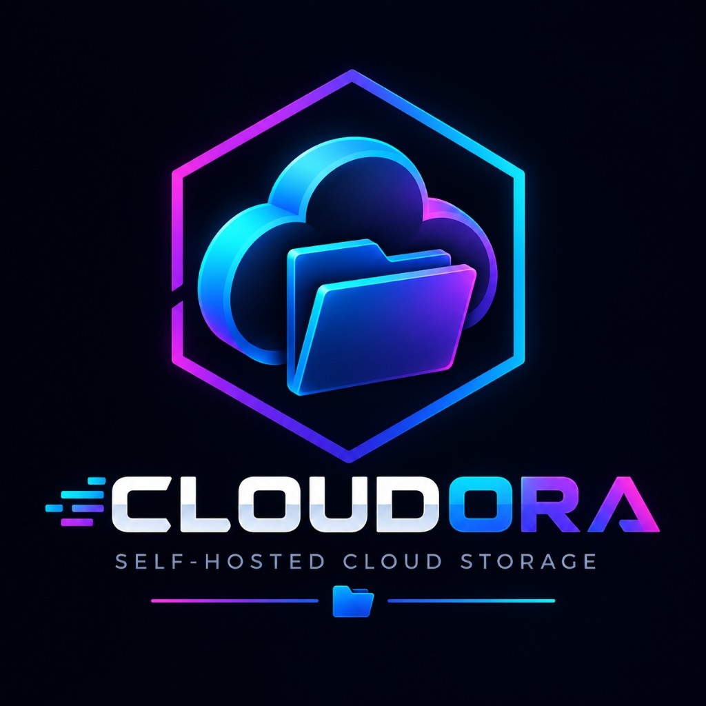
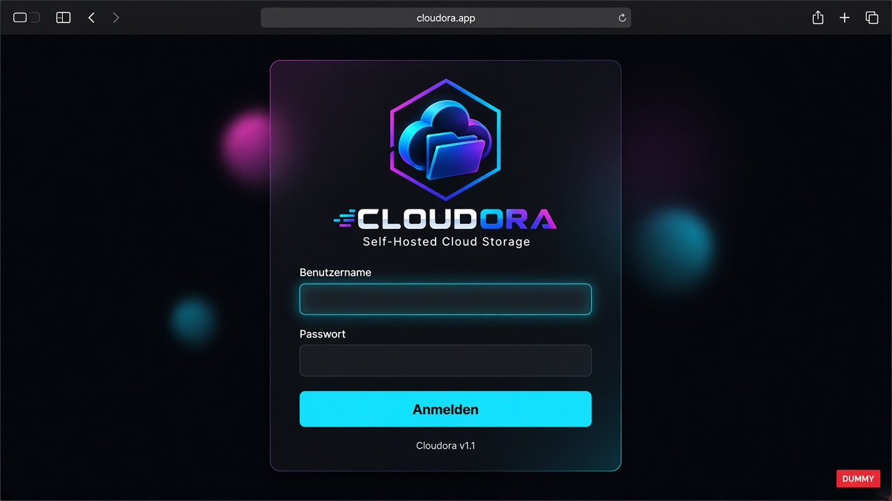
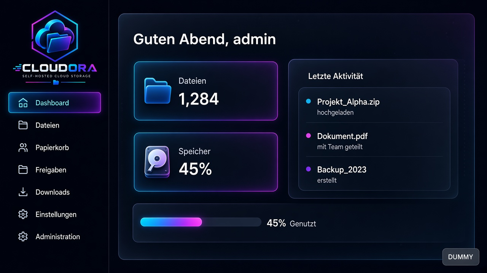
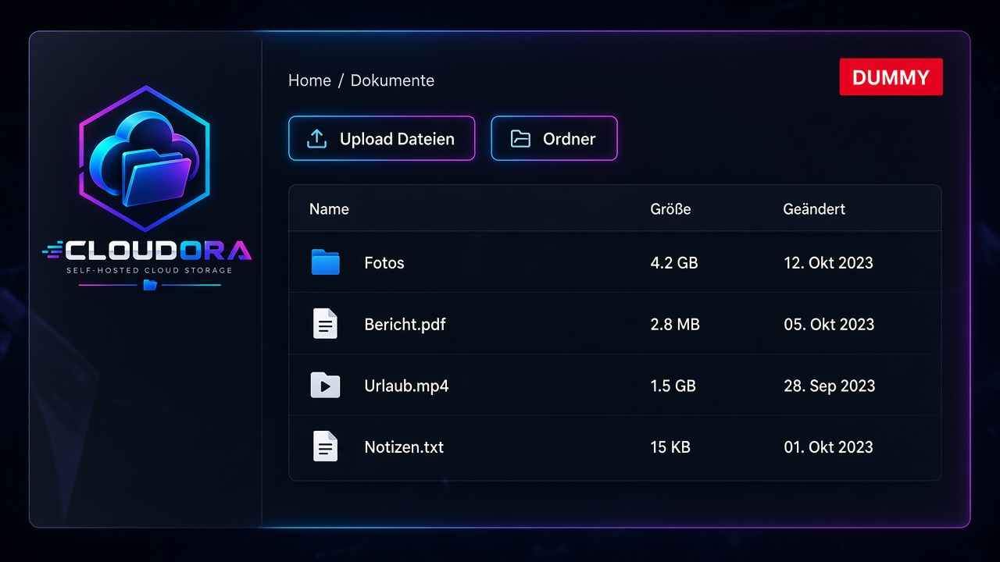

# Cloudora

**Self-hosted Cloud Storage & File Explorer** – modern, sicher, Docker-first.

[](./LICENSE)

> Status: **v1.2.6** – Self-Hosted Cloud Storage mit Papierkorb, 2FA, Backup, Self-Update und Extra-Volumes.

Cloudora ist der zentrale Datei- und Cloud-Speicher der gleichen Software-Familie wie [Proxora](https://github.com/MarcelRuh/proxora): dunkles, technisches UI, klare Administration, Self-Hosting hinter Nginx Proxy Manager.

Repository: [github.com/MarcelRuh/cloudora](https://github.com/MarcelRuh/cloudora)

<p align="center">
  
</p>

## Features

- Session-Login (Benutzername oder E-Mail), persistentes Rate-Limiting, sichere Cookies
- Optional TOTP-2FA (QR-Code) und Sitzungs-Widerruf
- RBAC (Administrator / Benutzer) plus granulare Datei-Flags
- Optionaler Home-Pfad mit serverseitigem Path-Jail (kein Path-Traversal)
- Datei-Explorer: Grid/List, Breadcrumbs, Drag & Drop, Multi-Select, Kontextmenü, Tastatur
- Upload mit Fortschritt, Download inkl. Ordner-ZIP (eingeloggt und öffentliche Freigabe)
- Papierkorb (30 Tage), Wiederherstellen oder endgültig löschen; stündliche Bereinigung abgelaufener Einträge
- Vorschau für Bilder, PDF, Text, Code, Video und Audio
- **Formator** – integrierter Editor (Monaco) mit Syntax-Highlighting
- One-Time-Downloads (Ablauf, Limit, optionales Passwort)
- Freigaben (Lesen / Download / Bearbeiten, inkl. Ordner)
- Dashboard, Benutzerverwaltung, Quotas in MB/GB, Audit-Log, Systeminfos inkl. freiem Speicher
- Datenbank-Backup in der UI (`pg_dump`); Dateien vom Host-Mount sichern
- Globale Suche (`Ctrl+K`)
- Docker Compose, PostgreSQL, persistenter Storage, in-app Self-Update

## Screenshots

Platzhalter-Mockups (kein Live-Stand der laufenden Instanz). Dark Mode ist Standard.

<p align="center">
  
</p>
<p align="center">
  
</p>
<p align="center">
  
</p>

Nach dem Start: Login → Dashboard → Dateien.

## Installation

### Einzeiler (wget)

Als root. Das Skript installiert bei Bedarf Git, wget, Docker Engine und das Compose-Plugin, legt `.env` an und startet den Stack.

```bash
wget -qO- https://raw.githubusercontent.com/MarcelRuh/cloudora/main/scripts/install.sh | bash
```

Nicht root:

```bash
wget -qO- https://raw.githubusercontent.com/MarcelRuh/cloudora/main/scripts/install.sh | sudo bash
```

Eigenes Verzeichnis:

```bash
wget -qO- https://raw.githubusercontent.com/MarcelRuh/cloudora/main/scripts/install.sh | sudo env CLOUDORA_DIR=/srv/cloudora bash
```

Aus einem bestehenden Checkout:

```bash
sudo bash scripts/install.sh
```

Standard-Installationspfad: das aktuelle Repository, sonst `/opt/cloudora` (`CLOUDORA_DIR` überschreibt das).

### Manuell

```bash
git clone https://github.com/MarcelRuh/cloudora.git
cd cloudora
cp .env.example .env
# SESSION_SECRET, ENCRYPTION_KEY und BOOTSTRAP_ADMIN_PASSWORD setzen
docker compose up -d --build
```

Anschließend:

```text
http://SERVER-IP:3000
```

Mit dem Bootstrap-Admin aus `.env` anmelden und das Passwort **sofort** ändern.

## Configuration

Siehe [`.env.example`](./.env.example). Wichtige Variablen:

| Variable | Bedeutung |
| --- | --- |
| `DATABASE_URL` | PostgreSQL-URL (in Compose automatisch gesetzt) |
| `SESSION_SECRET` | mind. 32 Zeichen |
| `ENCRYPTION_KEY` | mind. 32 Zeichen |
| `CLOUDORA_HOST_STORAGE` | Host-Pfad für Dateien (lokaler Ordner, extra Disk, NFS-Mount). Standard `./storage` |
| `CLOUDORA_STORAGE_PATH` | Pfad im Container, Standard `/storage` |
| `CLOUDORA_USERS_DIR` | Unterordner für Benutzer-Homes, Standard `users` |
| `CLOUDORA_SHARED_DIR` | Geteilter Ordner, Standard `shared` |
| `PUBLIC_URL` | Öffentliche URL hinter dem Reverse Proxy |
| `TRUST_PROXY` | `true` hinter Nginx Proxy Manager |
| `BOOTSTRAP_ADMIN_*` | Initialer Administrator (nur Seed) |
| `MAX_UPLOAD_BYTES` | hartes Upload-Limit |

Keine Secrets in Git committen.

## Docker Installation

- `docker-compose.yml` – Standard
- `docker-compose.prod.yml` – gleiche Stack-Struktur für Produktion

Volumes:

- PostgreSQL-Daten: Docker-Volume `postgres_data`
- Dateien: `${CLOUDORA_HOST_STORAGE}` → `${CLOUDORA_STORAGE_PATH}` (Standard `./storage` → `/storage`)

## Nginx Proxy Manager

Cloudora braucht **keinen** eigenen öffentlichen Reverse Proxy.

```text
Internet → Nginx Proxy Manager → cloudora:3000
```

Forwarded Headers werden berücksichtigt:

- `X-Forwarded-For`
- `X-Forwarded-Proto`
- `X-Forwarded-Host`

In NPM:

1. Proxy Host auf `cloudora` Port `3000` (Docker-Netz) oder Host-IP `:3000`
2. SSL-Zertifikat in NPM ausstellen (Let's Encrypt)
3. Websocket nicht erforderlich
4. `PUBLIC_URL=https://cloud.example.com` setzen
5. `TRUST_PROXY=true`

## Storage Configuration

Dateien liegen **nicht** in PostgreSQL. Die Datenbank enthält nur Metadaten.

Der **Host-Pfad** ist frei wählbar – lokales Verzeichnis, extra Festplatte, NFS oder USB-Mount:

```bash
# .env
CLOUDORA_HOST_STORAGE=/mnt/hdd/cloudora
CLOUDORA_STORAGE_PATH=/storage
```

Danach Container neu erzeugen, damit der Bind-Mount greift:

```bash
docker compose up -d
```

Zusätzliche Host-Ordner in der UI: **Administration → Speicher → Host-Ordner**. `/mnt`, `/media` und `/srv` sind im Container schreibbar — Ordner anlegen ohne Neustart. Nur ungewöhnliche Pfade (z. B. unter `/home`) schreiben noch `docker-compose.cloudora-volumes.yml`. `/host` bleibt nur zum Durchsuchen (lesen).

Manuell weiterhin: `docker-compose.override.example.yml` nach `docker-compose.override.yml` kopieren.

Pfade sind in der UI änderbar: **Administration → Speicher** (Storage-Root, Benutzer-/Shared-Ordner) und **Benutzer → Home-Pfad**.

Home-Pfad Beispiele:

- absolut: `/home`, `/home/anna`
- relativ zum Storage-Root: `users/anna`

Damit `/home` der Host ist, Volume `/home:/home` in der Override-Datei setzen.

```text
/storage                  ← CLOUDORA_STORAGE_PATH (Container)
├── users                 ← CLOUDORA_USERS_DIR
│   ├── marcel
│   └── user1
└── shared                ← CLOUDORA_SHARED_DIR
```

Datei-APIs senden interne Host-Pfade nicht an normale Clients. Alle Operationen laufen durch einen Path-Resolver mit Jail.

## User Management

Administratoren verwalten unter **Administration → Benutzer**:

- Benutzername, Anzeigename, E-Mail, Passwort
- aktiv / deaktiviert
- Rolle
- Home-Pfad an/aus + Pfad
- Speicherlimit (MB/GB, leer = unbegrenzt)
- Upload / Download / Löschen / Bearbeiten / Freigaben / One-Time-Downloads

Deaktivierte Benutzer können sich nicht anmelden. Home-Pfad-Benutzer können serverseitig nicht aus ihrem Verzeichnis ausbrechen.

## Security

- Passwort-Hashing (bcrypt)
- Session-Token nur als SHA-256 in der Datenbank
- CSRF über Origin-Check
- Login-Rate-Limit (PostgreSQL, Fallback Speicher)
- Path-Traversal-Schutz inkl. Symlink-realpath
- Quota-Enforcement vor Uploads
- One-Time-Tokens kryptografisch zufällig, nie sequenziell, nie mit Dateipfad
- Prisma gegen SQL-Injection
- `Content-Disposition` + `X-Content-Type-Options` bei Downloads
- Details: [docs/security.md](./docs/security.md)

## Development

Voraussetzungen: Node.js 22+, PostgreSQL 16

```bash
cp .env.example .env
npm install
npx prisma migrate deploy
npx prisma db seed
npm run dev
```

Tests:

```bash
npm test
npm run typecheck
```

## Updating

In der UI (empfohlen): **Administration → System → Jetzt aktualisieren**. Zeigt `current → latest`, Changelog und Fortschritt. Der Sidecar baut den Stack neu; `.env` und Storage bleiben.

CLI (erhält `.env` und Storage):

```bash
wget -qO- https://raw.githubusercontent.com/MarcelRuh/cloudora/main/scripts/update.sh | bash
```

oder lokal:

```bash
bash scripts/update.sh
```

oder:

```bash
git pull
docker compose up -d --build
```

Prisma-Migrationen laufen im Container-Entrypoint automatisch.

## Backup

Sichern:

1. In der UI: **Administration → System → Datenbank als SQL herunterladen** (`pg_dump`)
2. Dateispeicher unter `CLOUDORA_HOST_STORAGE` (inkl. `.trash`)
3. `.env`

Wiederherstellung: Dump per `psql` einspielen, Storage-Ordner zurückkopieren, `.env` legen, Stack starten. Es gibt absichtlich keinen Restore-Button in der UI.

## Documentation

- [Architecture](./docs/architecture.md)
- [Deployment](./docs/deployment.md)
- [Authentication](./docs/authentication.md)
- [Authorization](./docs/authorization.md)
- [Storage](./docs/storage.md)
- [Development](./docs/development.md)
- [Security](./docs/security.md)
- [Changelog](./CHANGELOG.md)

## License

[MIT](./LICENSE)
